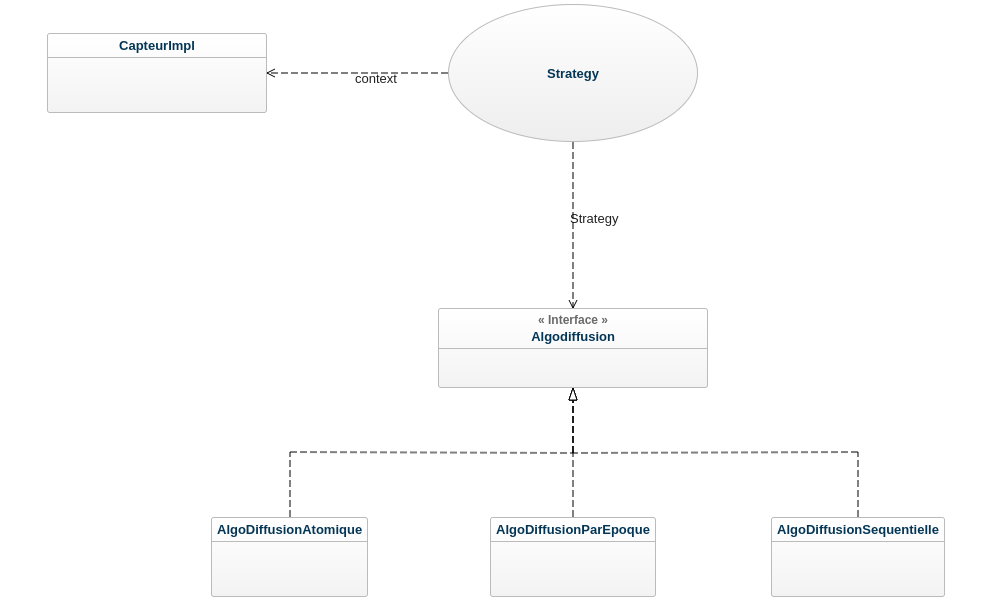
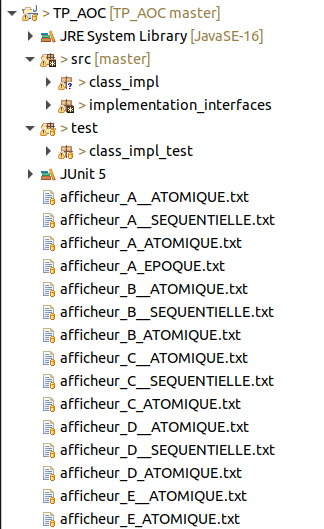
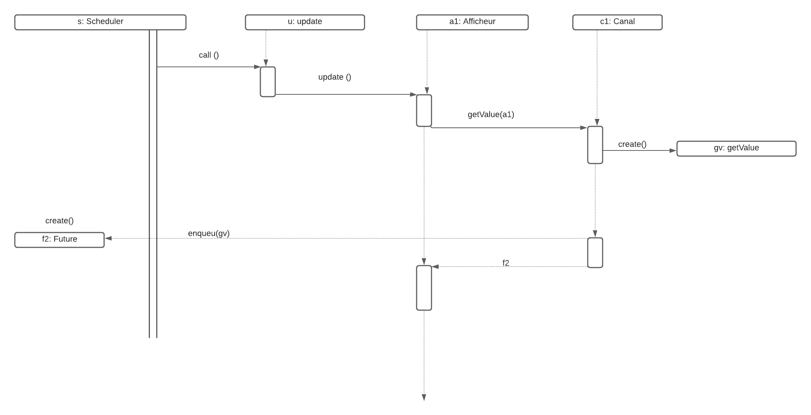

# TP_AOC
## Objectif

Ce projet a pour objectif principal de mettre en œuvre le concept d’invocation asynchrone d’opération. 
La motivation c’est que, des plates formes que nous utilisons de nos jours font appel à la programmation parallèle (architecture multicœurs), hétérogènes (données  dans le cloud), réparties et dynamiques. 

## Contexte

Afin de réaliser cet objectif, nous allons donc recourir au pattern de conception Active Object, parce  que ce pattern s’applique sur des langages qui ne prennent pas en charge l’appel asynchrone (comme le langage Java), et qu’on le fera en s’appuyant sur l’appel synchrone.

## Le patron de conception : Active Object

Le pattern active object, est un pattern qui dissocie l’exécution de la méthode invocation (MI) de la méthode pour les objets qui se trouvent chacun dans leur thread de contrôle respectif. Le diagramme du pattern active object comporte neuf rôles, comme nous pouvons le voir sur la figure ci-dessous. 

                    

## Les rôles de diagramme représentatif du pattern Active Objectif

Comme vous pouvez le remarquer, nous avons reparti les rôles de ce grand diagramme en trois parties, qui sont:
* la partie gauche : la partie gauche implémente le côté client, et il y a un thread qui s’en charge
* la partie droite : c’est dans le contexte du scheduler, et il y au moins un thread, dans le cas général plusieurs threads, ces derniers sont supervisés par le Scheduler 
* la partie haute : on a des classes ou des types qui participent à la communication et à  la synchronisations des deux autres parties 

Il convient de noter que le pattern Active Object pour sa conception il fait appel à d'autres patterns, qui sont :
* le pattern Proxy : qui est un patron de conception structurel qui fournit un objet qui agit comme un substitut pour un objet du service utilisé par un client; et dans ce projet, ce rôle de proxy sera joué par la classe Canal
* le pattern Observer : ce design pattern est utilisé pour envoyer des notifications (à chaque tick) aux capteurs qui jouent le rôle d'observateurs; et qu'en cas de notification, les observateurs effectuent alors l'action adéquate en fonction des informations qui parviennent depuis les modules qu'ils observent
* le pattern Strategy : c'est un patron de conception de type comportemental grâce auquel des algorithmes peuvent être sélectionnés à la volée au cours du temps d'exécution selon certaines conditions; 

  
Figure 3 : Pattern Strategy

## Architecture et Conception 

Le projet est conçu dans le respect des principes SOLID, qui est est un acronyme mnémonique qui regroupe cinq principes de conception destinés à produire des architectures logicielles plus compréhensibles, flexibles et maintenables; notemment le "I", Inversion des dépendances (Dependency inversion principle), qui voudrait à ce que l'implémentation d'une classe concrète dépende des abstractions (des Interfaces).

Toutes les interfaces sont regroupées dans le même pacquage, et les différentes classes qui implémentent ces interfaces, figurent également dans un pacquage qui leurs est dédié. La figure ci-dessous, laisse transparaître la configuration du projet.

  
Figure 4 : La structure de projet

## Implémentation des différentes interfaces 

Les interfaces sont : 

* Capteur
* Subject
* ObserverAsync
* SubjectAsync 
* Afficheur
* Strategy
* SubjectAsync

## Implémentation des classes concrètes 

Les classes concrètes sont :

* AlgoDiffusion
* Canal
* CapteurImpl
* DiffusionAtomique
* DiffisionSequentielle
* DiffusionEpoque
* Stratégy

## Zoom sur les différentes fonctionnalités 

Dans la classe concrète CapteurImpl, getValue : avec et sans paramètres … il faut faire la différence 

Canal joue le rôle de proxy pour le capteur, donc il fait se comporte comme un capteur. Par conséquent, il implémente les interfaces Subject et Capteur. 
Pour ce qui concerne les trois stratégies, nous avons implémenté la classe énumérée Stratégie, dont les éléments sont : DiffusionAtomique, DiffusionSequentielle et DiffusionEpoque

 
Figure 4 : diagramme de sequence 

## Package Test

Parce qu’on ne doit pas utiliser la méthode main(), il est donc recommandé de faire des tests sous Junit 5. On va implémenter une classe TEST.

Dans @BeforEach, on note  l’instanciation pour chaque algorithme de diffusion :

* 1 capteur
* canaux (canals)
* affichicheurs (faire du câblage, donc de la connexion pour afficher les données)
* scheduled ExecutorService (ES) pour faire l’injection de dépendance.

Dans la partie @Test, on exécute les tests 

* instanciation de stratégie 
* injecter pour chaque cas de test une stratégie dans le capteur
* faire une demande auprès de scheduledExecutorService d’exécuter périodiquement une méthode invocation qui appelle tick() sur la capteur 
* laisser le temps de simulation pendant que les threads s’exécutent
* arrêter les  tick() avec le lock() et unlock, donc assurer la gestion des verrous
* awaitTermination sur le  scheduledExecutorService (pour la resynchronisation).

 

