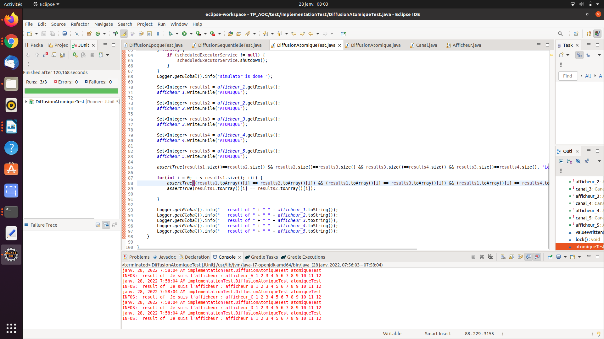
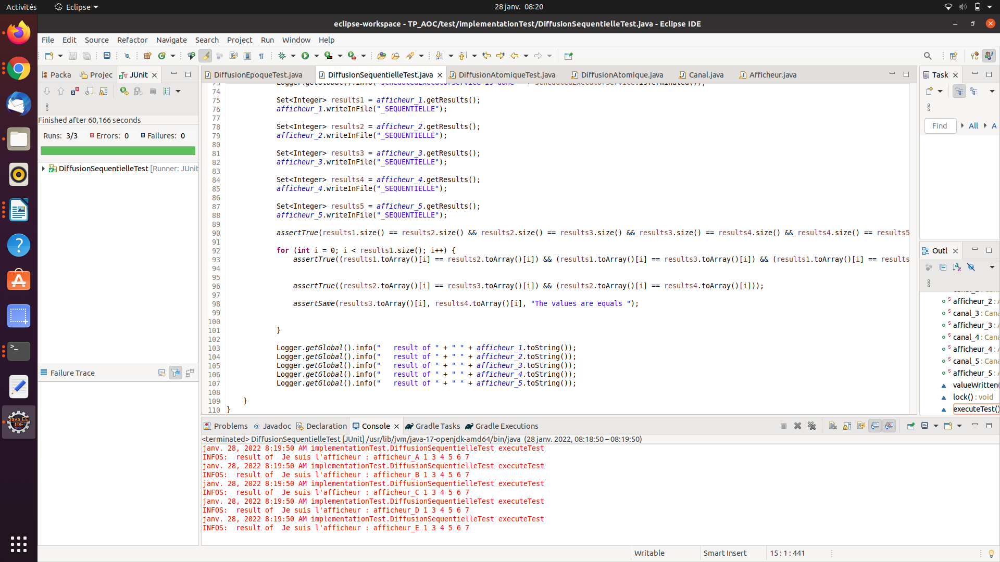
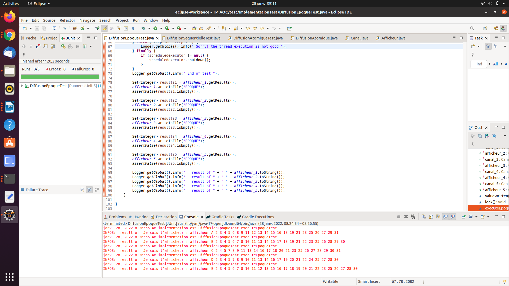

# TP_AOC

### Auteurs : 
- **SBAI Mouhcine**
- **MBILIA Maurice**
- **BRAHMI Said**

## Objectif

Ce projet a pour objectif principal de mettre en œuvre le concept d’invocation asynchrone d’opération. 
La motivation c’est que, des plateformes que nous utilisons de nos jours font appel à la programmation parallèle (architecture multicœur), hétérogènes (données  dans le cloud), réparties et dynamiques. 

## Contexte

Afin de réaliser cet objectif, nous allons donc recourir au pattern de conception Active Object, parce  que ce pattern s’applique sur des langages qui ne prennent pas en charge l’appel asynchrone (comme le langage Java), et qu’on le fera en s’appuyant sur l’appel synchrone.

## Le patron de conception : Active Object

Le pattern active object, est un pattern qui dissocie l’exécution de la méthode invocation (MI) de la méthode pour les objets qui se trouvent chacun dans leur thread de contrôle respectif. Le diagramme du pattern active object comporte neuf rôles, comme nous pouvons le voir sur la figure ci-dessous: 

  
 
 **Figure 1 : le diagramme de classe du pattern Active Object**

## Les rôles de diagramme représentatif du pattern Active Objectif

Comme vous pouvez le remarquer, nous avons reparti les rôles de ce grand diagramme en trois parties, qui sont:
* La partie gauche : la partie gauche implémente le côté client, et il y a un thread qui s’en charge.
* La partie droite : c’est dans le contexte du scheduler, et il y au moins un thread, dans le cas général plusieurs threads, ces derniers sont supervisés par le Scheduler.
* La partie haute : on a des classes ou des types qui participent à la communication et à  la synchronisations des deux autres parties. 

Il convient de noter que le pattern Active Object pour sa conception fait appel à d'autres patterns, qui sont :
* Le pattern Proxy : qui est un patron de conception structurel qui fournit un objet qui agit comme un substitut pour un objet du service utilisé par un client; et dans ce projet, ce rôle de proxy sera joué par la classe Canal.
* Le pattern Observer : ce design pattern est utilisé pour envoyer des notifications (à chaque tick) aux capteurs qui jouent le rôle d'observateurs; et qu'en cas de notification, les observateurs effectuent alors l'action adéquate en fonction des informations qui parviennent depuis les modules qu'ils observent
* Le pattern Strategy : c'est un patron de conception de type comportemental grâce auquel des algorithmes peuvent être sélectionnés à la volée au cours du temps d'exécution selon certaines conditions. Dans le diagramme de classe qui suit, nous avons une illustration du design pattern Strategy. 

  
**Figure 2 : Pattern Strategy**

## Les algorithmes de diffusions 

Regardons maintenant de plus près ce que fait chaque algorithme de diffusion.

### La diffusion atomique

Nous avons vu en cours qu'une opération atomique est une opération composée éventuellement de plusieurs actions, qui se déroule sans pouvoir être interrompue, en particulier par un autre thread. Dans une diffusion atomique, tous les observateurs reçoivent la même valeur (la valeur du sujet).

### La diffusion séquentielle

Dans une diffusion séquentielle, tous les observateurs reçoivent la même valeur, mais cette séquence peut être différente de celle du sujet.

### La diffusion par époque

La diffusion par époque (ou promesse) est la plus libre des trois. Elle permet de mettre à jour n'importe quelle valeur pour l'affichage  sans avoir à se préoccuper des autres. De ce fait, il n'est pas possible de prévoir l'ordre pour lequel des valeurs seront affichées.

## Architecture et Conception 

Le projet est conçu dans le respect des principes SOLID, qui est est un acronyme mnémonique qui regroupe cinq principes de conception destinés à produire des architectures logicielles plus compréhensibles, flexibles et maintenables; notemment le "I", Inversion des dépendances (Dependency inversion principle), qui voudrait à ce que l'implémentation d'une classe concrète dépende des abstractions (des Interfaces).

Toutes les interfaces sont regroupées dans le même package, et les différentes classes qui implémentent ces interfaces, figurent également dans un package qui leurs est dédié. La figure ci-dessous, laisse transparaître la configuration du projet.

  
**Figure 3 : La structure de projet**

## Implémentation des différentes interfaces 

Les interfaces sont : 

* Capteur
* Subject
* ObserverAsync
* SubjectAsync 
* Afficheur
* Strategy
* SubjectAsync

## Implémentation des classes concrètes 

Les classes concrètes sont :

* AlgoDiffusion
* Canal
* CapteurImpl
* DiffusionAtomique
* DiffisionSequentielle
* DiffusionEpoque
* Stratégy

## Zoom sur certaines fonctionnalités indispensables

### L'interface java.util.concurrent.ScheduledExecutorService

L'interface ScheduledExecutorService hérite de l'interface ExecutorService. Elle définit les fonctionnalités qui permettent de planifier l'exécution d'une tâche après un certain délai ou son exécution répétée avec un intervalle de temps fixe.
Il convient de noter que l'exécution d'une tâche se fait de manière **asynchrone** dans un thread dédié à cet effet.

Par ailleurs, la classe Executors est une fabrique qui permet de créer des instances de type Executor. Elle propose notamment plusieurs méthodes pour créer une instance de type ScheduledExecutorService. Les méthodes que nous avons principalement utilisées sont :
* newSingleThreadScheduledExecutor() : elle renvoie une instance de type ScheduledExecutorService qui n'utilise qu'un seul thread pour l'exécution des tâches.
* ScheduledFuture<Integer> scheduleWithFixedDelay(Runnable command, long initialDelay, long delay, TimeUnit unit) : Planifier l'exécution du Runnable fourni en paramètre après le délai précisé. La prochaine exécution est déterminée en ajoutant le delay au timestamp de la fin de la dernière exécution.
  
* scheduleAtFixedRate(capteur::tick, 2, 9, TimeUnit.SECONDS) : c'est pour planifier l'exécution du collable fourni en paramètre après le délai précisé. La prochaine exécution est déterminée en ajoutant l'initialDelay et la période multipliée par le nombre d'exécutions.
* awaitTermination(30, TimeUnit.SECONDS) : 
* shutdown() : pour demander la fermeture du service. Toutes les tâches en cours d'exécution se poursuivent jusqu'à leur fin mais plus aucune nouvelle tâche ne peut être ajoutée dans le service.
* newScheduledThreadPool(POOL_SIZE) : elle renvoie une instance de type ScheduledExecutorService qui utilise un pool de threads dont la taille est fournie en paramètre.
 
* awaitTermination(long timeout, TimeUnit unit) : Attendre l'achèvement des tâches après une demande d'arrêt ou la fin d'un délai ou l'interruption du thread courant selon ce qui se produira en premier.

Dans la classe concrète CapteurImpl, les méthodes getValue() (avec et sans paramètre), il fallait bien faire la différence entre les deux. 
Le "Canal" joue le rôle de proxy pour le capteur. Par conséquent, il implémente les interfaces Subject et Capteur. 
Pour ce qui concerne les trois stratégies, nous avons implémenté la classe énumérée Stratégie, dont les éléments sont : DiffusionAtomique, DiffusionSequentielle et DiffusionEpoque, ce qui fait qu'on peut switcher d'un algirithme de diffusion à un autre.

 
**Figure 4 : diagramme de sequence** 

## Package Test

Parce qu’on ne doit pas utiliser la méthode main(), il est donc recommandé de faire des tests sous Junit 5. Nous allons donc implémenter une classe dédiée aux tests.

Dans @BeforEach, on note  l’instanciation pour chaque algorithme de diffusion :

* 1 capteur.
* Canaux (canals), 5 canals.
* Afficheurs (faire du câblage, donc de la connexion pour afficher les données), on a instancié 5 afficheurs.
* scheduledExecutorService (ES) pour faire l’injection de dépendance.

Dans la partie @Test, on exécute les tests, on y trouve ce qui suit :

* instanciation de stratégie.
* injecter pour chaque cas de test une stratégie dans le capteur.
* faire une demande auprès de scheduledExecutorService d’exécuter périodiquement une méthode invocation qui appelle tick() sur la capteur.
* laisser le temps de simulation pendant que les threads s’exécutent.
* arrêter les  tick() avec le lock() et unlock, pour assurer la gestion des verrous.
* awaitTermination sur le  scheduledExecutorService (pour la resynchronisation).
 
### Les résultats des tests 
 
 les différents tests effectués pour chaque algorithme de diffusion donnent les résultats suivants : 
 
  
**Figure 5 : test diffusionAtomique**
 
   
**Figure 6 : test diffusionSequentielle**
 
   
**Figure 7 : test Epoque**

 

